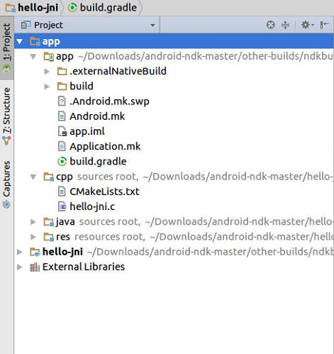

## 九月15日

​	上午是数据库原理的第一节课，老师讲了设计数据库会遇到的各种问题，要完善的话没有终点。下午去公司继续研究ndk，示例项目hello-jni有两个版本，CMake和ndk的，CMake的项目只支持armeabi-v7a平台，然而这个平台的虚拟机特别慢，就用ndk的，支持x86。平台支持信息是在Application.mk文件中定义的：

``` APP_ABI := armeabi armeabi-v7a x86 ```或者``` APP_ABI := all```以支持所有平台

Application.mk和Android.mk在同一个文件夹中，在文件夹APP中，可以在Project视图中看到：

