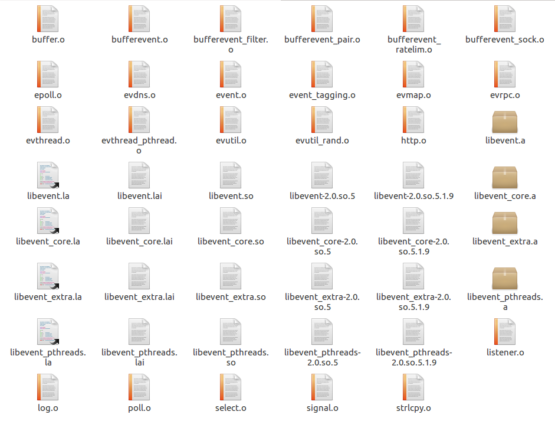

# 九月18日
上午尝试改写Client SDK中的server.c，添加到AS项目中，编译失败，找不到event2文件位置。  
下载了明哥给的[android-libevent编译](https://github.com/lycying/libevent-android)，编译失败，找不到libevent-2.0.22-stable/.libs文件夹。  
有2点知识还不懂：
1. Android.mk语法[链接](https://developer.android.google.cn/ndk/guides/index.html)
1. 编译的.c文件的方法名以及语法  
下午明哥让我改一下部分代码[链接](https://developer.android.google.cn/ndk/guides/index.html)，再用换用r14b版本的ndk编译上面github的项目，就成功了，生成的libevent静态库在/home/drager/Downloads/libevent-android-master/jni/libevent-2.0.22-stable/.libs文件夹中。  

